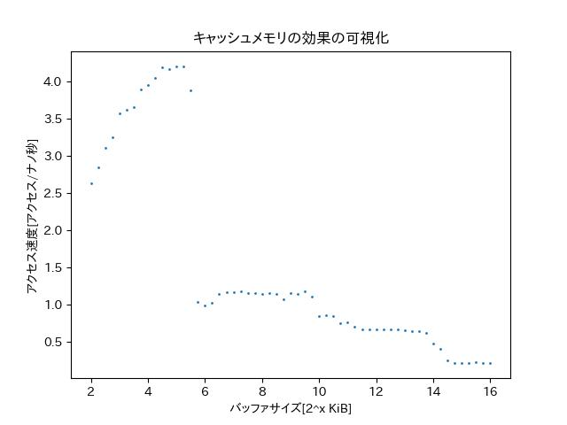
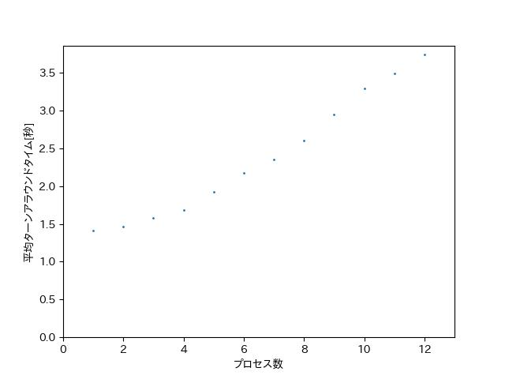
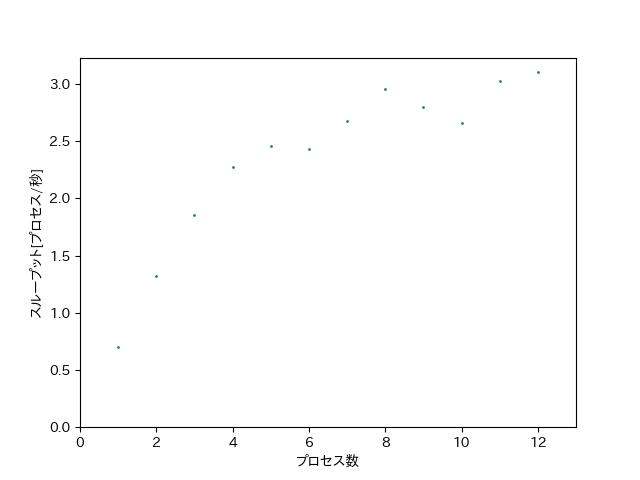

# 08_storage hierarchy

## 階層型キャッシュメモリ

|-|Level|type|shared_cpu_list|coherency_line_size|size[kb]|
|---|---|---|---|---:|---:|
|index0|Level 1|Data|0-1|64|48K|
|index1|Level 1|Instruction|0-1|64|32K|
|index2|Level 2|Unified|0-1|64|1280K|
|index3|Level 3|Unified|0-15|64|18432K|

## キャッシュメモリアクセス結果



## SMTの結果





## Page Cache効果

```
$ dd if=/dev/zero of=testfile oflag=sync bs=1G count=1
1+0 records in
1+0 records out
1073741824 bytes (1.1 GB, 1.0 GiB) copied, 0.718688 s, 1.5 GB/s

$ dd if=/dev/zero of=testfile bs=1G count=1
1+0 records in
1+0 records out
1073741824 bytes (1.1 GB, 1.0 GiB) copied, 0.609684 s, 1.8 GB/s
```

```
$ free
              total        used        free      shared  buff/cache   available
Mem:       16249164      560268    14275996        3480     1412900    15392432
Swap:       4194304           0     4194304

$ sudo su
# echo 3>/proc/sys/vm/drop_caches

# free
              total        used        free      shared  buff/cache   available
Mem:       16249164      559588    14274424        3504     1415152    15393292
Swap:       4194304           0     4194304
```

```
# dd if=testfile of=/dev/null bs=1G count=1
1+0 records in
1+0 records out
1073741824 bytes (1.1 GB, 1.0 GiB) copied, 0.259628 s, 4.1 GB/s
```

## 書き込みタイミング

```
$ sysctl vm.dirty_writeback_centisecs
vm.dirty_writeback_centisecs = 500

$ sysctl vm.dirty_background_ratio
vm.dirty_background_ratio = 10

$ sysctl vm.dirty_ratio
vm.dirty_ratio = 20
```

## Direct I/O
```
$ free
              total        used        free      shared  buff/cache   available
Mem:       16249164      554700    15355652        3488      338812    15412344
Swap:       4194304           0     4194304

$ dd if=/dev/zero of=testfile bs=1G count=1 oflag=direct,sync
1+0 records in
1+0 records out
1073741824 bytes (1.1 GB, 1.0 GiB) copied, 0.290045 s, 3.7 GB/s

$ free
              total        used        free      shared  buff/cache   available
Mem:       16249164      557476    15352776        3488      338912    15409608
Swap:       4194304           0     4194304
```

